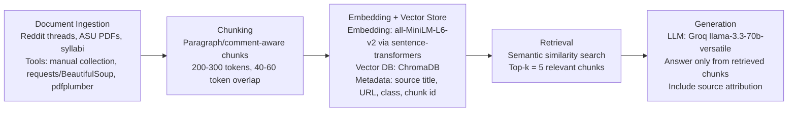

# Project 1 Planning: The Unofficial Guide

> Write this document before you write any pipeline code.
> Your spec and architecture diagram are what you'll use to direct AI tools (Claude, Copilot, etc.) to generate your implementation — the more specific they are, the more useful the generated code will be.
> Update the Retrieval Approach and Chunking Strategy sections if you change your approach during implementation.
> Update this file before starting any stretch features.

---

## Domain

Unofficial ASU CS Info & Surviving the Trifecta: CSE 330, CSE 340, and CSE 355

---

## Documents

| # | Source | Type | Description | URL or location |
|---|--------|------|-------------|-----------------|
| 1 | ASU CS Major Map — Official ASU PDF | Official ASU degree map | Overall CS degree path and where courses like CSE 330, CSE 340, and CSE 355 fit in the program. | https://degrees.apps.asu.edu/major-map/ASU00/ESCSEBS/null/ONLINE/2024/fetchpdf |
| 2 | Reddit r/ASU — “Opinions on hardest CS major classes and future” | Student discussion | Student opinions on the hardest ASU CS classes and future course planning. | https://www.reddit.com/r/ASU/comments/14b4dsh/opinions_on_hardest_cs_major_classes_and_future/ |
| 3 | Reddit r/ASU — “What is the hardest class for CS majors? Why?” | Student discussion | Student opinions on the most difficult CS major courses and why they are challenging. | https://www.reddit.com/r/ASU/comments/1i8h9ss/what_is_the_hardest_class_for_cs_majors_why_do/ |
| 4 | Reddit r/ASU — “Review of different CS professors” | Student professor review thread | Student opinions about different ASU CS professors, including teaching style, difficulty, and recommendations. | https://www.reddit.com/r/ASU/comments/1ixpih7/review_of_different_cs_professors/ |
| 5 | Reddit r/ASU — “CSE 330/340/355 over summer” | Student discussion | Discussion about whether taking CSE 330, CSE 340, and CSE 355 together during summer is manageable. | https://www.reddit.com/r/ASU/comments/1nv0vsg/cse_330340355_over_summer/ |
| 6 | Reddit r/ASU — “CS majors taking the trifecta this summer” | Student discussion | Student discussion about the “trifecta” experience of taking CSE 330, CSE 340, and CSE 355 together. | https://www.reddit.com/r/ASU/comments/1kldo1z/cs_majors_taking_the_trifecta_this_summer/ |
| 7 | Reddit r/ASU — “How difficult is CSE 340?” | Student discussion | Student discussion about CSE 340 difficulty, workload, and advice. | https://www.reddit.com/r/ASU/comments/1knq3au/how_difficult_is_cse_340/ |
| 8 | Reddit r/ASU — “CSE 340” | Student discussion | General student discussion about CSE 340. | https://www.reddit.com/r/ASU/comments/1pnnsmk/cse_340/ |
| 9 | Reddit r/ASU — “Which is most challenging: CSE 355, CSE 360, or CSE ___?” | Student discussion | Student discussion comparing the difficulty of CSE 355 with other ASU CS courses. | https://www.reddit.com/r/ASU/comments/1crjzby/which_is_most_challenging_cse_355_cse_360_or_cse/ |
| 10 | ASU SCAI — CSE 330 Syllabus SP25 | Official syllabus PDF | Official CSE 330 course structure, topics, assignments, grading, and expectations. | https://scai.engineering.asu.edu/wp-content/uploads/sites/31/2025/03/CSE-330-Sylllabus-SP25.pdf |
| 11 | ASU SCAI — CSE 340 Syllabus SP25 | Official syllabus PDF | Official CSE 340 course structure, topics, assignments, grading, and expectations. | https://scai.engineering.asu.edu/wp-content/uploads/sites/31/2025/03/CSE-340-Syllabus-SP25.pdf |
| 12 | ASU SCAI — CSE 355 Syllabus SP25 | Official syllabus PDF | Official CSE 355 course structure, topics, assignments, grading, and expectations. | https://scai.engineering.asu.edu/wp-content/uploads/sites/31/2025/03/CSE-355-Syllabus-SP25.pdf |
| 13 | Reddit r/ASU — “CSE 340 with Bazzi during the summer” | Student professor/course discussion | Student opinions about taking CSE 340 with Bazzi during summer, including professor-specific expectations and workload. | https://www.reddit.com/r/ASU/comments/1rr8aya/cse340_with_bazzi_during_the_summer/ |
| 14 | Reddit r/ASU — “CSE 330 and 355 profs” | Student professor recommendation thread | Student recommendations and opinions about professors for CSE 330 and CSE 355. | https://www.reddit.com/r/ASU/comments/178cksm/cse_330_and_355_profs/ |

---

## Chunking Strategy

**Chunk size:**
About 200–300 tokens per chunk, while trying to keep full Reddit comments, paragraphs, or syllabus sections together when possible.

**Overlap:**
About 40–60 tokens of overlap between chunks.

**Reasoning:**
My documents are a mix of short Reddit discussions and longer official ASU PDFs/syllabi. A token-based chunking strategy fits better than a fixed character split because the embedding model and LLM process text in tokens. For Reddit comments, I want chunks to preserve a full student opinion or piece of advice so the system does not lose context. For syllabi and the major map, 200–300 tokens is enough to keep related information together, such as grading policies, assignments, course topics, or workload expectations, without making the chunk too broad. The 40–60 token overlap helps preserve context when important information crosses a chunk boundary.
---

## Retrieval Approach

**Embedding model:**
I will use `all-MiniLM-L6-v2` through the `sentence-transformers` library. This model is a good fit for the project because it runs locally, does not require a paid API, and is the recommended embedding model for the starter stack. The embeddings will be stored in ChromaDB for semantic search. :contentReference[oaicite:0]{index=0}

**Top-k:**
I will retrieve the top 5 chunks for each user query. I chose `top-k = 5` because my documents include both short opinion-based Reddit comments and longer official ASU syllabi. Retrieving too few chunks, like only 1 or 2, could miss useful context, especially if the answer is spread across multiple comments or sources. Retrieving too many chunks could add unrelated information and make the LLM’s answer less focused. Starting with 5 gives the system enough context while still keeping the response grounded.

**Production tradeoff reflection:**
If this were deployed for real users and cost was not a constraint, I would compare embedding models based on retrieval accuracy, context length, latency, and support for informal student language. My corpus includes Reddit discussions, professor opinions, and official ASU PDFs, so I would want a model that understands both casual wording and formal course descriptions. Semantic search is useful here because students might ask “Is CSE 340 brutal?” while a source might say “CSE 340 has a heavy workload.” Even without the same exact words, embeddings can match the meaning of the query to relevant chunks.  

For production, I would also consider a model with a longer context window if the documents contain long syllabus sections or detailed professor reviews. I would weigh latency against accuracy because students expect fast answers, but the system also needs to retrieve the right evidence. I would prioritize accurate, grounded retrieval over speed alone, since the goal is to answer from the collected documents rather than from the model’s general knowledge.
---

## Evaluation Plan

## Evaluation Plan

| # | Question | Expected answer |
|---|----------|-----------------|
| 1 | Is it a good idea to take CSE 340 in the summer with Bazzi? | The system should summarize the student feedback from the “CSE 340 with Bazzi during the summer” Reddit thread. It should explain whether students describe Bazzi as a good option, whether the summer pace is manageable, and what students should watch out for. |
| 2 | How hard is it to take CSE 330, CSE 340, and CSE 355 together in the summer? | The system should use the trifecta/summer Reddit threads to explain whether students think this combination is manageable or overwhelming. It should mention the workload, pacing, and difficulty concerns students bring up. |
| 3 | Which one is harder: CSE 340 or CSE 355? | The system should compare student comments from the CSE 340 difficulty thread and the CSE 355 difficulty thread. It should explain which class students describe as harder and why, without making claims that are not in the sources. |
| 4 | Who should I take for CSE 330 or CSE 355? | The system should use the “CSE 330 and 355 profs” Reddit thread and any professor review sources to summarize student recommendations, warnings, or preferences for professors teaching those classes. |
| 5 | What should I expect from CSE 340 based on both the syllabus and student reviews? | The system should combine the official CSE 340 syllabus with student discussion threads to describe the course topics, workload, assignments/exams, and student-perceived difficulty. |

---

## Anticipated Challenges

1. Some of my sources may be noisy or inconsistent because Reddit comments are informal and opinion-based. Different students may disagree about whether a class or professor is difficult, so the system needs to summarize patterns in the retrieved sources instead of treating one comment as the final answer.

2. Retrieval may return off-topic or incomplete chunks if the chunking is not done carefully. For example, a student comment might mention CSE 330, CSE 340, and CSE 355 in the same thread, but the actual useful advice may be split across multiple comments or chunks. If the key context is separated, the LLM may give a partial answer or cite a source that does not fully support the response.

3. Source attribution could be difficult if multiple Reddit threads discuss similar topics, like “the trifecta” or CSE 340 difficulty. I need to store clear metadata for each chunk, including the source title and URL, so the final answer can show where the information came from instead of just saying “Reddit.”

---

## Architecture

---

## AI Tool Plan

**Milestone 3 — Ingestion and chunking:**  
I plan to use Claude inside VS Code to help implement the document ingestion and chunking code. I will give Claude my Documents section, Chunking Strategy section, and Architecture diagram. I will ask it to create functions that load my Reddit text files and ASU PDF syllabi, clean unnecessary text, preserve source metadata, and split the documents into paragraph/comment-aware chunks of about 200–300 tokens with 40–60 tokens of overlap. I expect it to produce Python functions such as `load_documents()`, `clean_text()`, and `chunk_text()`. I will verify the output by running the code locally, printing at least 5 random chunks, and checking that they are readable, self-contained, not empty, and still include the correct source title/URL metadata.

**Milestone 4 — Embedding and retrieval:**  
I plan to use Claude inside VS Code to help write the embedding and retrieval code. I will give Claude my Retrieval Approach section, Architecture diagram, and the project requirement that embeddings should use `all-MiniLM-L6-v2` with ChromaDB. I will ask it to implement code that loads my chunks, creates embeddings using `sentence-transformers`, stores them in ChromaDB with metadata, and retrieves the top 5 most relevant chunks for a user query. I expect it to produce functions such as `build_vector_store()` and `retrieve_chunks(query, top_k=5)`. I will verify the output by testing at least 3 of my evaluation questions and checking whether the returned chunks are actually relevant, have reasonable distance scores, and include source information.

**Milestone 5 — Generation and interface:**  
I plan to use Claude inside VS Code to help connect retrieval to the Groq LLM and build the user interface. I will give Claude my Evaluation Plan, Retrieval Approach, Architecture diagram, and the requirement that answers must be grounded only in retrieved chunks with source attribution. I will ask it to create an `ask(question)` function that retrieves chunks, sends them to `llama-3.3-70b-versatile` through Groq, and returns an answer plus a list of sources. I will also ask it to help create a simple Gradio interface with a question input, answer output, and sources output. I will verify the output by asking my 5 evaluation questions and one out-of-scope question. The system should cite sources for supported answers and say it does not have enough information when the retrieved documents do not answer the question.

I may also use ChatGPT to help debug errors, explain concepts, and pressure-test decisions, but Claude in VS Code will be my main coding assistant. I will not blindly accept AI-generated code; I will run it, inspect the outputs, and compare it against this planning document.

## Stretch Feature Plan

I plan to attempt the following stretch features after completing the required pipeline first. I will update this section again before implementing each stretch feature.

**Hybrid Search:**  
I plan to combine semantic search with keyword-based BM25 search. Semantic search should help with meaning-based queries like “Is CSE 340 brutal?” while BM25 may help with exact terms like professor names, course numbers, or “Bazzi.” I will compare hybrid search results against semantic-only retrieval using the same evaluation questions.

**Chunking Strategy Comparison:**  
I plan to test at least two chunking strategies on the same set of evaluation questions. My main strategy will be paragraph/comment-aware token chunks of about 200–300 tokens with 40–60 tokens of overlap. I may compare this against smaller chunks or a more fixed-size token chunking approach. I will report which one retrieves more relevant chunks and why.

**Metadata Filtering:**  
I plan to store metadata for each chunk, including source title, URL, source type, course number, and date when available. This could allow users to filter results by source type, such as only Reddit discussions, only official ASU documents, or only sources related to CSE 340.

**Conversational Memory:**  
If time allows, I plan to support simple multi-turn conversation memory. For example, if a user first asks about CSE 340 and then asks “What about with Bazzi in the summer?”, the system should remember that the follow-up is still about CSE 340. I will keep this memory limited so the answer is still grounded in retrieved chunks.